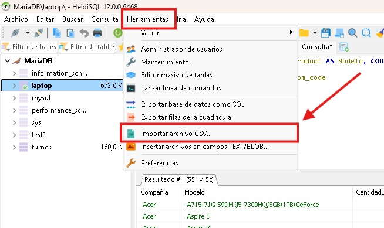
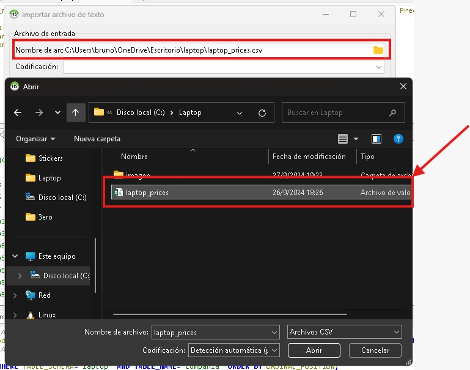
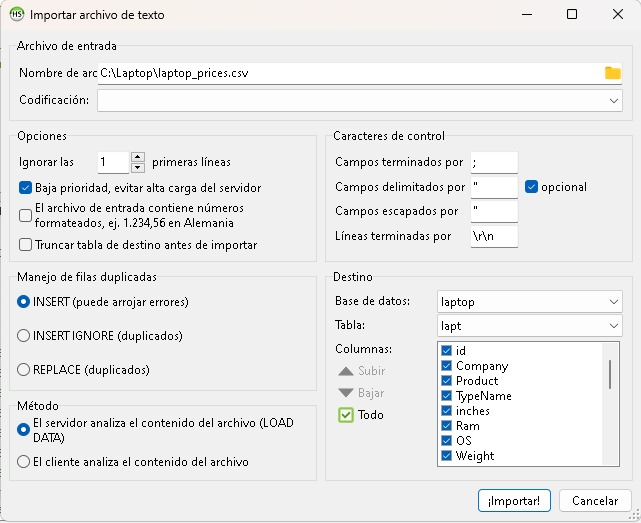
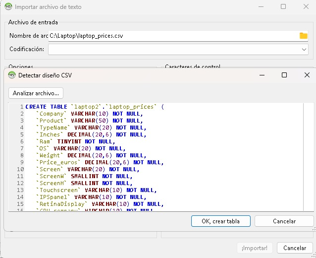
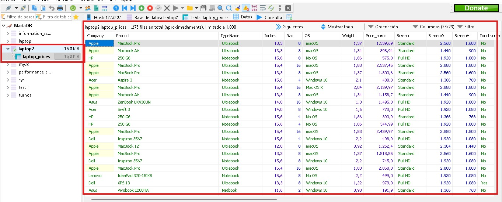
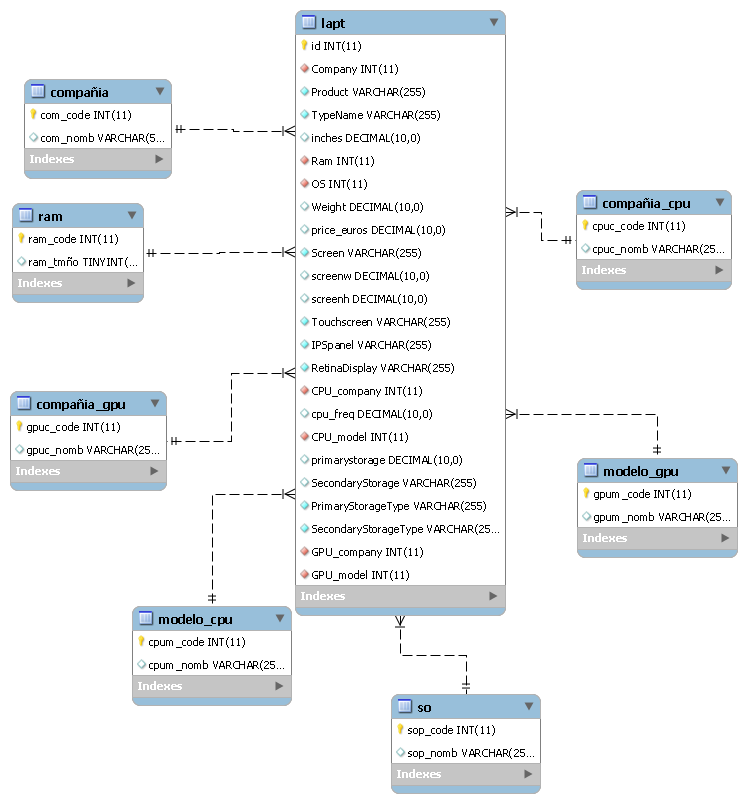

# Normalización de Base de Datos de Laptops.

# Introduccion
#### Este repositorio contiene la documentacion necesaria para poder realizar la normalizacion de una Base de Datos a partir de un archivo CSV.
---------------------------------------------------------------------------------------------------------------
## Base de datos: Laptops
En esta base de datos encontraremos la informacion sobre las compañias, los nombre de los productos (Laptops), la ram, el Sistema Operativo, costo, GPU model, GPU company, CPU company, CPU model, etc. 

Elegimos esta base de datos porque nos parecio que era una muy completa y entretenida para normalizar. Comenzamos descargando la base de datos de la páguina Kaggle

Lo descargamos en un archivo CSV que es lo que te permite abrirlo en HeidiSQL.

## 1. Instalación

# Abrir HeidiSQL
Una vez abierto nuestro programa para base de datos, seguir las intrucciones para poder importarla correctamente.<p>
  Luego de haber entrado a nuestro lugar de trabajo, nos dirigimos a la parte superior izquierda donde se encuentra la ventana Herramientas, hacemos click y buscamos la opción de "Importar archivo CSV".<p>


Una vez abierto buscamos la carpeta y el archivo



Nos dirigimos a la parte que dice base de datos y tabla



Se crea la base de datos y la tabla general



Nos dirijimos al botón importar


Y listo! base de datos importada con su tabla principal




<h2><p>2. Uso</p></h2>

Una vez cargada la base de datos y creada todas las tablas, nos dirigiremos a la parte inferior para seguir los pasos y comprobar que funcione correctamente.
------------------------------------------------------------------------------------------------------------------------------------------------------------------------------
<h2>3. Diagrama de Relación de Entidad</h2> 


------------------------------------------------------------------------------------------------------------------------------------------------------------------------------
## 4. CREACION DE TABLAS

<h2>Creamaos las tablas que usaremos en la base de datos a partir de la tabla principal.</h2>
  
### Creacion de la tabla compañia:
```sql
CREATE TABLE compañia ( com_code BIGINT PRIMARY KEY AUTO_INCREMENT NOT NULL,  com_nomb VARCHAR(50)); 
```

### Creacion de la tabla ram:
```sql    
CREATE TABLE ram (ram_code BIGINT PRIMARY KEY AUTO_INCREMENT NOT NULL,  
ram_tmño tinyint);
```

### Creacion de la tabla SO:
```sql    
CREATE TABLE so (sop_code BIGINT PRIMARY KEY AUTO_INCREMENT NOT NULL,  
sop_nomb VARCHAR(10));
```
### Creacion de la tabla Precio:
```sql  
CREATE TABLE precio (pre_code BIGINT PRIMARY KEY AUTO_INCREMENT NOT NULL, pre_cant BIGINT);
```

 ### Creacion de la tabla Comañia_CPU:
```sql
CREATE TABLE compañia_cpu (cpuc_code BIGINT PRIMARY KEY AUTO_INCREMENT NOT NULL,  cpuc_nomb VARCHAR(25));
```

### Creacion de la tabla Modelo_CPU:   
```sql
CREATE TABLE modelo_cpu (cpum_code BIGINT PRIMARY KEY AUTO_INCREMENT NOT NULL,  cpum_nomb VARCHAR(50));
```

### Creacion de la tabla Modelo_GPU:
```sql  
CREATE TABLE modelo_gpu (gpum_code BIGINT PRIMARY KEY AUTO_INCREMENT NOT NULL,  gpum_nomb VARCHAR(50));
```

### Creacion de la tabla Compañia_GPU: 
```sql
CREATE TABLE compañia_gpu (gpuc_code BIGINT PRIMARY KEY AUTO_INCREMENT NOT NULL,  gpuc_nomb VARCHAR(50));
```
------------------------------------------------------------------------------------------------------------------------------------------------------------------------------
<h2>5 Importación de datos</h2>

#### Tabla compañia
```sql
    INSERT INTO compañia(com_nomb)
    SELECT DISTINCT company
    FROM lapt;
```
#### Tabla ram
```sql
    INSERT INTO ram(ram_tmño)
    SELECT DISTINCT Ram
    FROM lapt;
```
#### Tabla so
```sql
    INSERT INTO so(sop_nomb)
    SELECT DISTINCT os
    FROM lapt;
```
#### Tabla compañia_cpu
```sql
    INSERT INTO compañia_cpu(cpuc_nomb)
    SELECT DISTINCT cpu_company
    FROM lapt;
```
#### Tabla modelo_cpu
```sql
    INSERT INTO modelo_cpu(cpum_nomb)
    SELECT DISTINCT cpu_model
    FROM lapt;
```
#### Tabla modelo_gpu
```sql
    INSERT INTO modelo_gpu(gpum_nomb)
    SELECT DISTINCT gpu_model
    FROM lapt;
```
#### Tabla compañia_gpu
```sql
    INSERT INTO compañia_gpu(gpuc_nomb)
    SELECT DISTINCT gpu_company
    FROM lapt;
```
------------------------------------------------------------------------------------------------------------------------------------------------------------------------------
<h2>6 Modificacion de datos</h2>

<h3>Modificación de la tabla Compañia:</h3>

<h4>1- Luego de hacer todos los pasos anteriores cambiamos el valor original por el código que lo identifica de la tabla compañia</h4>
    

```sql
    UPDATE lapt
    SET Company = ( SELECT com_code FROM compañia WHERE com_nomb = lapt.Company)
    WHERE lapt.id > 0;
```
<h4>2- Se cambia el valor de la columna Company de Varchar a INT, para relacionarla con la Columna com_code de la tabla Compañía.</h4>

```sql
   ALTER TABLE lapt MODIFY Company INT NOT NULL
```

<h4>3- Colocamos el comando para cambiar el valor de la columna a INT.</h4>

```sql
  ALTER TABLE compañia MODIFY com_code INT NOT NULL;
```
<h4>4- Se agrega la foreign key a la columna Compnay:</h4>

```sql
  ALTER TABLE lapt ADD CONSTRAINT fk_lapt_company FOREIGN KEY (Company) REFERENCES compañia(com_code);
```

<h3>Modificación de la tabla Ram:</h3>

<h4>1- Cambiamos valor original por el código que lo identifica de la tabla ram.</h4>

```sql
 UPDATE lapt
SET Ram = ( SELECT ram_code FROM ram WHERE ram_tmño = lapt.Ram)
WHERE lapt.id > 0;
```

<h4>2- Se cambia el valor de la columna Ram de Varchar a INT, para relacionarla con la Columna com_code de la tabla ram.</h4>

```sql
  ALTER TABLE lapt MODIFY Ram INT NOT NULL
```

<h4>3- Comando para cambiar el valor de la columna a INT.</h4>

```sql
ALTER TABLE ram MODIFY ram_code INT NOT NULL;
```

<h4>4- Se agrega la foreign key a la columna Ram:</h4>

```sql
  ALTER TABLE lapt ADD CONSTRAINT fk_lapt_ram FOREIGN KEY (Ram) REFERENCES ram(ram_code);
```

<h3>Modificación de la tabla Sistema Operativo:</h3>

<h4>1- Cambiamos valor original por el código que lo identifica de la tabla SO.</h4>

```sql
  UPDATE lapt
  SET OS = ( SELECT sop_code FROM so WHERE sop_nomb = lapt.OS)
  WHERE lapt.id > 0;
```

<h4>2- Se cambia el valor de la columna SO de Varchar a INT, para relacionarla con la Columna com_code de la tabla os.</h4>

```sql
  ALTER TABLE lapt MODIFY OS INT NOT NULL
```

<h4>3- Comando para cambiar el valor de la columna a INT.</h4>

```sql
  ALTER TABLE so MODIFY sop_code INT NOT NULL;
```

<h4>4- Se agrega la foreign key a la columna Sistema Operativo:</h4>

```sql
  ALTER TABLE lapt ADD CONSTRAINT fk_lapt_so FOREIGN KEY (OS) REFERENCES
  so(sop_code);
```

<h3>Modificación de la tabla Compañia_CPU:</h3>

<h4>1- Cambiamos valor original por el código que lo identifica de la tabla cpu_company</h4>

```sql
UPDATE lapt
SET CPU_company = ( SELECT cpuc_code FROM compañia_cpu WHERE cpuc_nomb = lapt.CPU_company)
WHERE lapt.id > 0;
```

<h4>2- Se cambia el valor de la columna compañia_cpu de Varchar a INT, para relacionarla con la Columna com_code de la tabla cpu_company.</h4>

```sql
ALTER TABLE lapt MODIFY CPU_company  INT NOT NULL
```

<h4>3- Comando para cambiar el valor de la columna a INT.</h4>

```sql
ALTER TABLE compañia_cpu MODIFY cpuc_code INT NOT NULL;
```
<h4>4- Se agrega la foreign key a la columna Compañia_cpu:</h4>

```sql
ALTER TABLE lapt ADD CONSTRAINT fk_lapt_compañia_cpu FOREIGN KEY (CPU_company) REFERENCES compañia_cpu(cpuc_code);
```
<h3>Modificación de la tabla Modelo_CPU:</h3>

<h4>1- Cambiamos valor original por el código que lo identifica de la tabla cpu_moel</h4>

```sql
UPDATE lapt
SET CPU_model = ( SELECT cpum_code FROM modelo_cpu WHERE cpum_nomb = lapt.CPU_model)
WHERE lapt.id > 0;
```
<h4>2- Se cambia el valor de la columna Modelo_cpu de Varchar a INT, para relacionarla con la Columna com_code de la tabla cpu_moel.</h4>

```sql
ALTER TABLE lapt MODIFY CPU_model  INT NOT NULL
```
<h4>3- Comando para cambiar el valor de la columna a INT.</h4>

```sql
 ALTER TABLE modelo_cpu MODIFY cpum_code INT NOT NULL;
```
<h4>4- Se agrega la foreign key a la columna Modelo_cpu:</h4>

```sql
ALTER TABLE lapt ADD CONSTRAINT fk_lapt_modelo_cpu FOREIGN KEY (CPU_model) REFERENCES modelo_cpu(cpum_code);
```

<h3>Modificación de la tabla Compañia_GPU:</h3>

<h4>1- Cambiamos valor original por el código que lo identifica de la tabla gpu_company:</h4>

```sql
UPDATE lapt
SET GPU_company = ( SELECT gpuc_code FROM compañia_gpu WHERE gpuc_nomb = lapt.GPU_company)
WHERE lapt.id > 0;
```

<h4>2- Se cambia el valor de la columna Compañia_gpu de Varchar a INT, para relacionarla con la Columna com_code de la tabla GPU_company.</h4>

```sql
ALTER TABLE lapt MODIFY GPU_company  INT NOT NULL
```
<h4>3- Comando para cambiar el valor de la columna a INT.</h4>

```sql
ALTER TABLE compañia_gpu MODIFY gpuc_code INT NOT NULL;
```
<h4>4- Se agrega la foreign key a la columna Compañia_gpu:</h4>

```sql
ALTER TABLE lapt ADD CONSTRAINT fk_lapt_compañia_gpu FOREIGN KEY (GPU_company) REFERENCES compañia_gpu(gpuc_code);
```

<h3>Modificación de la tabla Modelo_GPU:</h3>

<h4>1- Cambiamos valor original por el código que lo identifica de la tabla GPU_moel</h4>

```sql
UPDATE lapt
SET GPU_model = ( SELECT gpum_code FROM modelo_gpu WHERE gpum_nomb = lapt.GPU_model)
WHERE lapt.id > 0;
```
<h4>2- Se cambia el valor de la columna Modelo_gup de Varchar a INT, para relacionarla con la Columna com_code de la tabla GPU_model.</h4>

```sql
 ALTER TABLE lapt MODIFY GPU_model  INT NOT NULL
```
<h4>3- Comando para cambiar el valor de la columna a INT.</h4>

```sql
ALTER TABLE modelo_gpu MODIFY gpum_code INT NOT NULL;
```
<h4>4- Se agrega la foreign key a la columna Modelo_gpu:</h4>

```sql
ALTER TABLE lapt ADD CONSTRAINT fk_lapt_modelo_gpu FOREIGN KEY (GPU_model) REFERENCES modelo_gpu(gpum_code);
```
--------------------------------------------------------------------------------
<h2>7 Modificacion de valores</h2>

<h3>Modificamos los valores de las tablas a decimal:</h3>

```sql
ALTER TABLE lapt
MODIFY price_euros DECIMAL,
MODIFY inches DECIMAL,
MODIFY Weight DECIMAL,
MODIFY screenw DECIMAL,
MODIFY screenh DECIMAL,
MODIFY cpu_freq DECIMAL,
MODIFY primarystorage DECIMAL;
```
------------------------------------------------------------------------------------------------------------------------------------------------------------------------------

##8 Consultas:
1- Mostrar los productos que pertenecen a una cierta compañia y que tengan una ram menor a 16 y que el precio sea mayor a 2500 euros.
```sql
   SELECT product AS producto, company AS compañia, price_euros AS precio_en_euros, ram AS ram 
FROM lapt
WHERE ram < 16 AND price_euros > 2500;
```

2- Calcular el precio promedio de los laptops por compañía:
```sql
SELECT company AS compañia, AVG(price_euros) AS precio_promedio
FROM lapt
GROUP BY company;
```
3-Encontrar las compañías que tienen más de 10 modelos de laptops:
```sql
SELECT company AS compañia, COUNT(*) AS cantidad_modelos
FROM lapt
GROUP BY company
HAVING COUNT(*) > 10;
```
4- Todas las laptops con Sistema operativo Windows 10.
```sql
SELECT l.Product AS Laptop, s.sop_nomb AS SistemaOperativo
FROM lapt l
JOIN so s ON l.OS = s.sop_code 
WHERE s.sop_nomb = 'Windows 10';
```
5-Todos los productos de la compañia Dell.
```sql
SELECT DISTINCT c.com_nomb AS Compañia, l.Product AS Producto
FROM lapt l
JOIN compañia c ON l.Company = c.com_code
WHERE c.com_nomb ='Dell';
```

6- Mostrar compañía ‘Acer’, el modelo con la cantidad total de cada uno, la ram y el precio.
```sql
SELECT c.com_nomb AS Compañia, l.Product AS Modelo, COUNT(l.Product) AS CantidadDeModelos, price_euros AS Precio, Ram AS ram
FROM lapt l
JOIN compañia c ON l.Company = c.com_code
WHERE l.Company = 3
GROUP BY c.com_nomb, l.Product;
```
## Conclusión
Como conlusión podemos decir que pudimos cumplir con el objetivo, que era terminar el trabajo y entregarlo. 
Las herramientas que utilizamos para trabajar la base de datos fueron varias, entre ellas el Heidi, Workbench, Xampp y Docker. 
Al principio, optamos por la base de datos de los Juegos Olimpicos de Paris, pero mediante avanzabamos aparecian mas problemas, y a falta de una semana de entrega, cambiamos la base de datos por otra y tuvimos que empezar desde cero. Con todos los problemas y trabas que se nos presentaron, pudimos terminar y entregar a tiempo.

## Bibliografía
Archivo csv sacado desde https://www.kaggle.com/datasets/owm4096/laptop-prices
paginas donde buscamos informacio: geminis.google.com,https://www.w3schools.com/sql/default.asp
